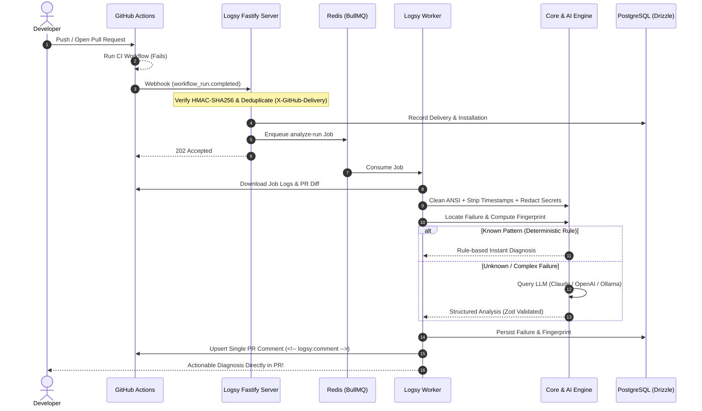

<p align="center">
  
</p>

<p align="center">
  <strong>Intelligent, noise-free CI failure analysis for GitHub Actions.</strong><br>
  <em>Pinpoints the root cause in thousands of log lines, redacts secrets, and posts one concise, actionable PR comment.</em>
</p>

<p align="center">
  <a href="https://github.com/nodejs/node"></a>
  <a href="https://www.typescriptlang.org/"></a>
  <a href="https://fastify.dev/"></a>
  <a href="https://orm.drizzle.team/"></a>
  <a href="https://redis.io/"></a>
  <a href="https://turbo.build/"></a>
  <a href="./LICENSE"></a>
</p>

---

## 💡 Why Logsy?

When continuous integration fails, developers frequently waste valuable time digging through thousands of raw terminal lines, trying to identify whether a failure is a real bug or a flaky test.

**Logsy eliminates CI noise:**

- 🛡️ **Zero Secret Leaks**: Strict redaction for API keys, tokens, and PII before anything is cached, stored, or sent to an LLM.
- 🎯 **Pinpoint Accuracy**: Normalizes error outputs and generates cryptographic fingerprints to recognize recurring breakages.
- ⚡ **Rules First, LLM Second**: Instant deterministic matches for standard toolchains (Node, Maven, Gradle, Python, Docker); leverages LLMs (Claude, OpenAI, or local Ollama) with PR diff context only when needed.
- 💬 **Single Updatable PR Comment**: Never spams developers. Creates a single, concise comment that updates when new commits are pushed, and flips to a green badge when the build passes.
- 📊 **Flaky Test Intelligence**: Automatically analyzes test histories to detect intermittent failures.
- 🔒 **100% Self-Hostable**: Built to run entirely in your own infrastructure with a single `docker compose up`.

---

## 🏛️ Architecture & Data Flow

<p align="center">
  
</p>

### End-to-End Workflow



---

## 📁 Repository Structure

Logsy is structured as an enterprise-grade TypeScript monorepo powered by **pnpm workspaces** and **Turborepo**:

```text
logsy/
├── apps/
│   ├── server/          # Fastify API: GitHub webhook ingestion, signature validation, REST endpoints
│   ├── worker/          # BullMQ background workers: log fetching, processing, LLM analysis, reporting
│   └── web/             # Next.js 15 dashboard (App Router, Tailwind CSS, shadcn/ui)
│
├── packages/
│   ├── core/            # Zero-I/O pure engine: log parsing, error extraction, secret redaction, fingerprinting
│   ├── github/          # Octokit app integration, typed helpers, comment generation
│   ├── llm/             # Pluggable LLM interface with Anthropic, OpenAI, and Ollama adapters
│   ├── db/              # PostgreSQL schema, Drizzle ORM definitions, and automated migrations
│   ├── queue/           # BullMQ queues, typed job schemas, and Redis connection pool
│   └── config/          # Shared TypeScript, ESLint, and runtime Zod environment validation
│
├── docs/
│   ├── github-app-setup.md # Complete step-by-step GitHub App configuration guide
│   └── assets/          # Architecture diagrams, graphics, and screenshots
│
└── deploy/
    ├── docker-compose.yml # Postgres 16 and Redis 7 local development services
    └── helm/            # Production Kubernetes deployment charts (coming soon)
```

---

## 🚀 Quick Start

### Prerequisites

- **Node.js**: `v22.12.0+` LTS
- **pnpm**: `v10.x` (`npm install -g pnpm@10`)
- **Docker & Docker Compose** (for PostgreSQL and Redis)

### 1. Clone & Install Dependencies

```bash
git clone https://github.com/<your-org>/Logsy.git
cd Logsy

pnpm install
```

### 2. Configure Environment

Copy the example environment file:

```bash
cp .env.example .env
```

_For local testing, the default database and Redis values in `.env.example` connect directly to the Docker containers._

### 3. Spin Up Infrastructure

Start the PostgreSQL 16 and Redis 7 containers:

```bash
# Start containers in background
pnpm db:up

# Apply Drizzle database migrations
pnpm db:migrate
```

### 4. Run Quality Checks

```bash
pnpm lint        # Run ESLint across all workspaces
pnpm typecheck   # Validate strict TypeScript types
pnpm test        # Run unit & integration test suites via Vitest
pnpm build       # Build all packages and apps via Turborepo
```

### 5. Start Local Webhook Server & Worker

```bash
pnpm dev:server   # Fastify webhook receiver
pnpm dev:worker   # BullMQ worker: fetches logs, analyzes failures
```

### 6. Measure Analysis Accuracy

```bash
pnpm evals        # scores the pipeline against labeled real CI logs
pnpm evals --llm  # also sends unmatched fixtures to the configured LLM
```

> 📖 To connect a real repository with webhooks, follow the [GitHub App Setup Guide](./docs/github-app-setup.md).

---

## 🗺️ Roadmap & Current Status

- [x] **Phase 0: Infrastructure & Skeleton**
  - Turborepo monorepo setup, strict TypeScript & ESLint configuration.
  - Docker Compose for Postgres 16 & Redis 7.
  - GitHub Actions CI matrix with automated checks.
- [x] **Phase 1: Webhook Ingestion & Database Layer**
  - Fastify server with raw-body HMAC SHA-256 (`X-Hub-Signature-256`) verification.
  - Delivery deduplication (`X-GitHub-Delivery`) and idempotency checks.
  - Drizzle ORM schema, migrations, and repository/installation persistence.
  - Complete [GitHub App Setup Guide](./docs/github-app-setup.md).
- [x] **Phase 2: Queues, Workers & Log Ingestion**
  - BullMQ queue integration and worker service.
  - Secure download and staging of failed workflow logs.
- [x] **Phase 3: Log Processing Core**
  - ANSI stripping, timestamp cleaning, error boundary detection.
  - Comprehensive high-entropy token & secret redaction engine.
- [x] **Phase 4: Error Fingerprinting & Deterministic Rules**
  - Error normalization, SHA-256 fingerprinting, deduplication cache.
  - Fast-path deterministic rule engine (20+ common failure modes).
- [x] **Phase 5: Hybrid LLM Engine & Evals**
  - Adapters for Anthropic Claude, OpenAI, and local Ollama.
  - Accuracy eval harness against real-world CI logs.
- [ ] **Phase 6: GitHub PR Commenting** _(Next)_
  - Single, updatable comment with hidden markers.
  - State transitions ("Fix Suggested" ➔ "✅ Passing").
- [ ] **Phase 7: Web Dashboard**
  - Next.js dashboard with GitHub OAuth and analytics.
- [ ] **Phase 8: Flaky Test Intelligence**
  - Historical JUnit artifact tracking and flaky detection.
- [ ] **Phase 9: Production Packaging**
  - Multi-stage Dockerfiles, Helm charts, and OpenTelemetry observability.

---

## 📊 Accuracy

`pnpm evals` runs the real pipeline over the labeled CI logs in `evals/fixtures/` — collected from
public failures in Maven, Gradle, pytest, pandas, vitest, ESLint, TypeScript, Docker Compose and
pre-commit — and writes a dated report to `evals/results/`.

Baseline (rules only, no LLM calls), 2026-09-19:

| Metric                  | Value                          |
| ----------------------- | ------------------------------ |
| Fixtures                | 10                             |
| Resolved without an LLM | 8                              |
| Category accuracy       | 80% overall · 100% of answered |
| Keyword hit rate        | 76%                            |
| Average confidence      | 0.90                           |
| Cost                    | $0.00                          |

The two unanswered fixtures have no recognizable pattern (a custom script error and a bare
`exit 1`) — exactly the cases the LLM layer exists for. A wrong answer costs more trust than no
answer, so the rules stay silent rather than guess.

---

## 🛡️ Security & Privacy

Logsy is designed from the ground up for strict enterprise security:

- **No Raw Secrets Sent to LLMs**: All inputs are scrubbed through a multi-pass regex and entropy-based redaction engine before LLM inference or database storage.
- **Self-Hosted Privacy**: Compatible with local LLMs via Ollama, allowing 100% of your build logs and diffs to stay entirely on-premise.
- **Cryptographic Webhook Verification**: All incoming GitHub webhook payloads are validated against your secret using constant-time HMAC SHA-256 comparison.

---

## 📄 License

This project is licensed under the [MIT License](./LICENSE).
