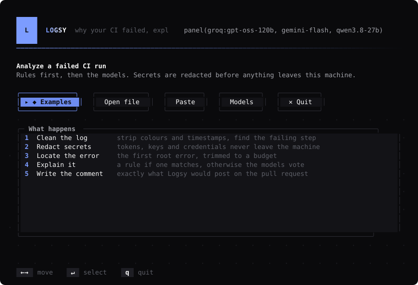
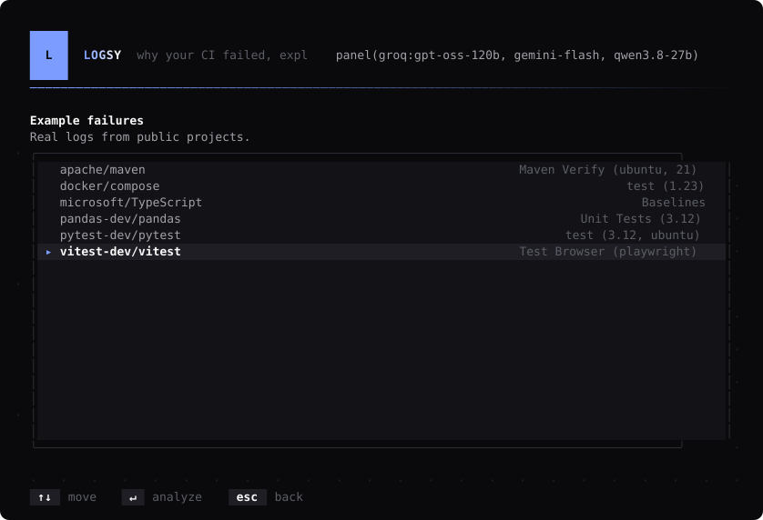
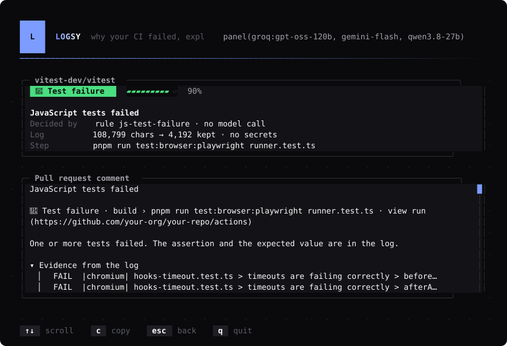
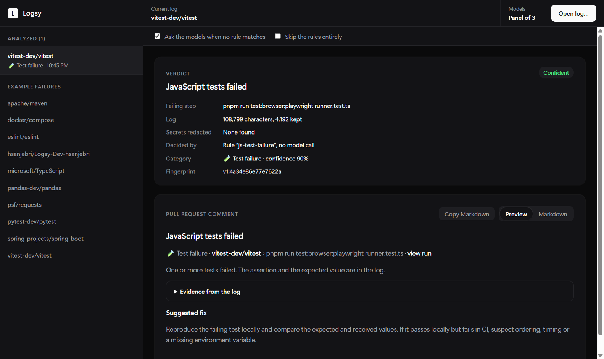
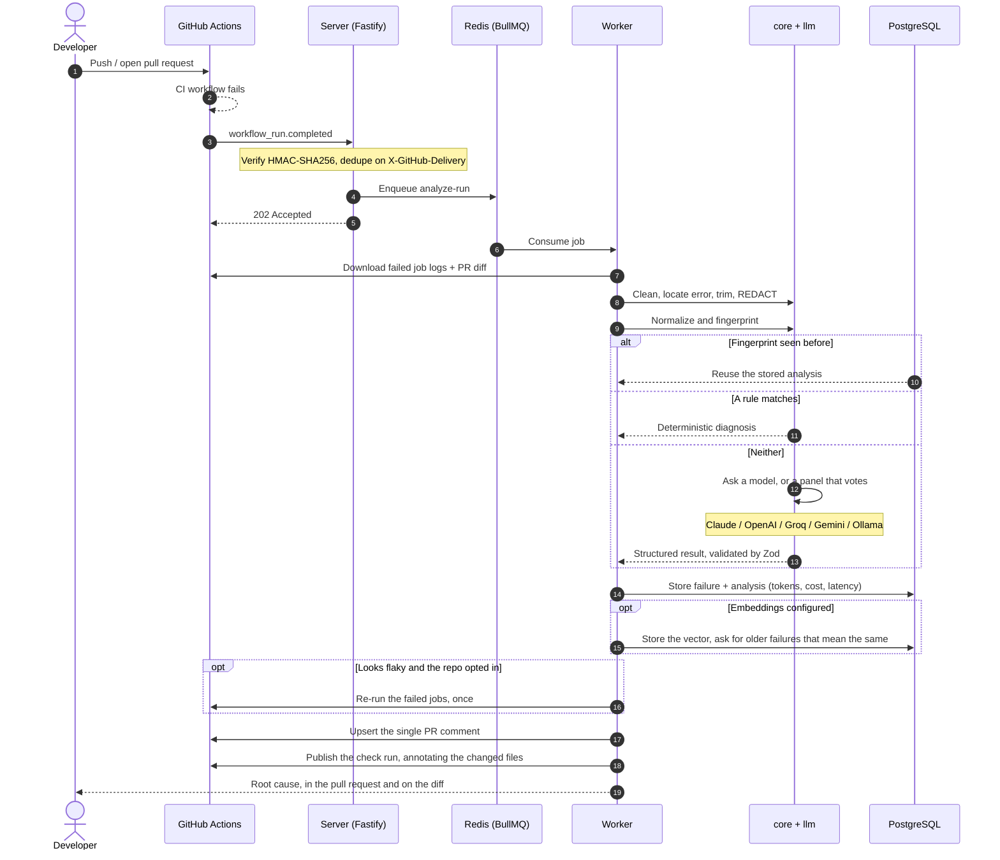

<p align="center">
  
</p>

<p align="center">
  <strong>Intelligent, noise-free CI failure analysis for GitHub Actions.</strong><br>
  <em>Finds the real error in thousands of log lines, redacts secrets, and posts one concise, actionable PR comment.</em>
</p>

<p align="center">
  <a href="https://github.com/nodejs/node"></a>
  <a href="https://www.typescriptlang.org/"></a>
  <a href="https://fastify.dev/"></a>
  <a href="https://orm.drizzle.team/"></a>
  <a href="https://redis.io/"></a>
  <a href="https://turbo.build/"></a>
  <a href="./LICENSE"></a>
</p>

---

## The problem

CI fails. You open the run, scroll through 4,000 lines of `npm install` output, find three
different red blocks, and spend ten minutes working out which one actually broke the build —
only to discover it was the same flaky test as last Tuesday.

Logsy installs as a GitHub App. On the next failure it reads the logs, finds the root error,
and leaves one comment on the pull request:

<p align="center"><em>Screenshots of the terminal and desktop apps are further down, in
<a href="#see-it">See it</a>.</em></p>

Real output, from `pnpm demo` over a fixture in this repository:

```markdown
### npm could not resolve the dependency tree

📦 Dependency error · **build** › `npm ci` · [view run](https://github.com/…/actions/runs/…)

npm found conflicting peer dependency requirements and refused to install a tree that
satisfies none of them.

<details>
<summary>Evidence from the log</summary>

npm ERR! ERESOLVE unable to resolve dependency tree
npm ERR! Found: react@18.3.1
npm ERR! peer react@"^19.0.0" from react-dom@19.0.0

</details>

**Suggested fix**

Read the conflict npm prints and align the versions in package.json. …

> Seen 4 times in this repository

---

matched a known failure pattern · confidence 90% · Was this helpful? [👍](…) [👎](…) · Logsy for `9f2c1ab`
```

That is the whole product. One comment, updated in place on every re-run, replaced by a
✅ when the build goes green.

---

## What it does

**On the pull request**

- 🎯 **Finds the real error.** Strips ANSI codes and timestamps, splits the log into steps,
  locates the failing one, and prefers the first root error over the cascade of follow-up
  errors it caused. A 108,000-character log becomes a 4,000-character excerpt.
- 🛡️ **Redacts before anything else.** GitHub tokens, AWS keys, JWTs, private key blocks,
  connection strings, bearer tokens and high-entropy strings become `[REDACTED:type]`
  **before** any log is stored, logged or sent to a model.
- ⚡ **Rules first, models second.** 26 deterministic rules cover the common failures across
  Node, Java/Maven, Gradle, Python, Go and Docker — instant, free, and never wrong about a
  pattern they match. A model is asked only about what the rules cannot answer.
- 💬 **One comment. Ever.** Found by a hidden marker and updated in place, never re-posted,
  and switched to "✅ now passing" when the run goes green. Below 0.5 confidence it shows
  the error excerpt and says nothing more: a wrong answer costs more trust than no answer.
- 📍 **On the diff itself.** A check run puts the explanation on the exact lines in _Files
  changed_, on the files your pull request actually touched. Its conclusion is always
  `neutral` — Logsy explains failures, it never adds one.
- 🎲 **Knows your flaky tests.** Parses JUnit artifacts, flags any test that both passed and
  failed on the same commit, and can re-run the failed jobs once instead of making you
  notice (`autoRerun`, off by default, never more than once per run).
- 🧠 **Remembers what it has seen.** Fingerprints catch the identical error; optional
  embeddings catch _the same problem worded differently_, and link the pull request it
  happened in: _"Seen something like this before: the same conflict, in another package,
  in #4, 91% alike."_

**How it decides**

- 🤝 **A panel of models that check each other.** Two or three models analyze each failure in
  parallel and vote. Agreement is kept; disagreement caps the confidence below the comment
  threshold, so Logsy shows the excerpt rather than guessing. A rate-limited or failing
  member is simply outvoted. Measured on the eval set: each model alone reaches 60–70%
  accuracy, the panel 80%, and a panel of three posted **no confidently wrong answer at
  all**.
- 💸 **Free to run.** Groq and Google both give away enough for this: the panel in the
  screenshots costs nothing. Or bring an Anthropic or OpenAI key, or point it at Ollama and
  keep every byte on your own hardware.
- 📊 **Measurable.** `pnpm evals` scores the analysis against labelled real CI logs and
  reports accuracy, keyword hit rate, tokens, cost, and how often it would have posted a
  wrong cause.

**Four ways to use it**

|                 |                                                                                  |
| --------------- | -------------------------------------------------------------------------------- |
| **GitHub App**  | The product: install it, and the next failed run gets a comment and a check run. |
| **`logsy` CLI** | A full-screen terminal app for any log on your machine.                          |
| **Desktop app** | The same analysis in a window: drop a log on it.                                 |
| **Playground**  | A page in the dashboard: paste a log, see the comment. No login.                 |

---

## See it

### The terminal app

`pnpm -s logsy` opens a full-screen app: pick one of the ten real CI failures it ships
with, drop in your own log, or paste one. Rules answer instantly; when the models are
asked, the bar shimmers while they think.

<p align="center">
  
</p>

The ten bundled failures are real logs from public projects — Maven, pytest, pandas,
TypeScript, Vitest, Docker Compose and more — listed by repository and failing job:

<p align="center">
  
</p>

The report shows what was found and how it was decided, then the exact comment it would
post, scrollable, with `c` to copy the Markdown:

<p align="center">
  
</p>

### The desktop app

`pnpm desktop` opens the same analysis in a window, with the logs you have analyzed on the
left and the comment rendered as GitHub would show it on the right:

<p align="center">
  
</p>

### The playground

`pnpm dev:web`, then <http://localhost:3002/playground>: paste a log or pick an example and
see the verdict and the rendered comment. It needs no login, and it only spends model quota
when `PLAYGROUND_LLM=true`.

---

## Architecture

<p align="center">
  
</p>



The receiver does no heavy work: it verifies, dedupes, enqueues and returns `202` in
milliseconds. Everything expensive happens in the worker, where it can be retried.

### Repository layout

```text
logsy/
├── apps/
│   ├── cli/             # `logsy analyze`: run the analysis on any log from the terminal
│   ├── desktop/         # Electron app: drop a log in, read the verdict and the comment
│   ├── server/          # Fastify: webhook receiver, health, signature verification
│   ├── worker/          # BullMQ jobs: analyze-run, post-comment, test-report
│   └── web/             # Next.js dashboard (App Router, Tailwind, Auth.js)
├── packages/
│   ├── core/            # Pure, zero-I/O: cleaning, error location, redaction,
│   │                    #   fingerprinting, rules, JUnit parsing, comment markdown
│   ├── github/          # Octokit app, typed helpers for jobs, logs, artifacts, PRs
│   ├── llm/             # Providers (Anthropic, OpenAI, Groq, Gemini, Ollama),
│   │                    #   panel voting, embeddings, the shared analysis pipeline
│   ├── ui/              # React components shared by the dashboard and the desktop app
│   ├── db/              # Drizzle schema (pgvector), migrations, query helpers
│   ├── queue/           # Queue names, Zod job payloads, Redis connection
│   └── config/          # Zod-validated env, shared tsconfig and ESLint config
├── evals/               # Labeled real CI logs + accuracy harness
├── deploy/
│   ├── docker-compose.yml
│   └── helm/            # Kubernetes chart
└── docs/
    ├── github-app-setup.md
    └── self-hosting.md
```

`packages/core` performs no I/O at all — no network, no database, no filesystem. That is
what makes the interesting half of this project testable with plain strings.

---

## Quick start

### Prerequisites

- Node.js 22.12+ · pnpm 10 · Docker

### Try it on a log, no setup

No GitHub App, database or API key needed:

```bash
git clone https://github.com/hsanjebri/Logsy.git && cd Logsy
pnpm install

pnpm -s logsy                            # menus: pick a log, read the report, repeat
pnpm demo                                # straight to a report, rules only
pnpm logsy analyze path/to/ci.log        # your own log (or - for stdin)
```

Run with no arguments and Logsy opens its menus: ten real failed builds to try, a file
path, or a pasted log, with the models switchable from the same place and the finished
comment one keypress from your clipboard. Piped or scripted, it stays a plain command.

It prints what Logsy found (failing step, secrets redacted, fingerprint, how it decided)
and the PR comment it would post. With an LLM configured in `.env` (a single model or a
free-tier panel, see [self-hosting](./docs/self-hosting.md)), unmatched failures go to the
model; `--llm-only` skips the rules to see what the model says, and `--json` prints the
full result.

Prefer a window? `pnpm desktop` opens the desktop app: drop a log on it, or pick one of
the real failed builds it ships with, and read the verdict and comment side by side. It
is Electron, so the first run downloads its runtime.

Prefer a page? `pnpm dev:web` and open <http://localhost:3002/playground>: paste a log (or
pick an example) and see the verdict and the rendered PR comment. It needs no login. It
uses the LLM only when `PLAYGROUND_LLM=true`, since anyone who can reach it could
otherwise spend your quota.

### Local development

```bash
git clone https://github.com/hsanjebri/Logsy.git
cd Logsy
pnpm install
cp .env.example .env

pnpm db:up          # Postgres 16 + Redis 7
pnpm db:migrate

pnpm lint && pnpm typecheck && pnpm test
```

Then, in three terminals:

```bash
pnpm dev:server     # webhook receiver  :3000
pnpm dev:worker     # analysis worker
pnpm dev:web        # dashboard         :3002
```

To connect a real repository, follow the [GitHub App setup guide](./docs/github-app-setup.md) —
it covers permissions, events, the private key and forwarding webhooks with smee.

### Self-hosting

```bash
cp .env.example .env    # fill in the GitHub App values
docker compose --env-file .env -f deploy/docker-compose.yml --profile apps up -d
```

Postgres, Redis, migrations, server, worker and dashboard. See
[docs/self-hosting.md](./docs/self-hosting.md) for the Helm chart, upgrades, backups and
running without any LLM.

---

## Accuracy

`pnpm evals` runs the real pipeline over the labeled CI logs in `evals/fixtures/` —
collected from public failures in Maven, Gradle, pytest, pandas, vitest, ESLint,
TypeScript, Docker Compose and pre-commit — and writes a dated report to `evals/results/`.

Baseline (rules only, no LLM calls), 2026-09-19:

| Metric                  | Value                          |
| ----------------------- | ------------------------------ |
| Fixtures                | 10                             |
| Resolved without an LLM | 8                              |
| Category accuracy       | 80% overall · 100% of answered |
| Keyword hit rate        | 76%                            |
| Average confidence      | 0.90                           |
| Cost                    | $0.00                          |

The two unanswered fixtures have no recognizable pattern (a custom script error and a bare
`exit 1`) — exactly the cases the LLM layer exists for. A wrong answer costs more trust than
no answer, so the rules stay silent rather than guess.

### What the models add

`pnpm evals --llm-only` skips the rules so every fixture reaches the models. Measured on
the same ten fixtures, with free-tier providers:

| Setup                           | Category accuracy | Wrong cause posted | Excerpt only |
| ------------------------------- | ----------------- | ------------------ | ------------ |
| Groq `gpt-oss-120b` alone       | 70%               | —                  | —            |
| Groq `qwen3.8-27b` alone        | 60%               | —                  | —            |
| Gemini Flash alone              | crashed on a 503  | —                  | —            |
| Panel of two (GPT-OSS + Gemini) | 80%               | 2                  | 0            |
| **Panel of three (+ Qwen)**     | 70–80%            | **0**              | 5            |

Both panels beat every single model, and Gemini's outage never showed: the others answered.
"Wrong cause posted" is the number that matters — a confident, wrong explanation on
someone's pull request. The panel of three never produced one, at the price of staying
quiet more often. In production the rules answer most failures first, so the panel only
sees what they cannot.

```bash
pnpm evals             # rules only, free
pnpm evals --llm       # send the unmatched fixtures to the configured model
pnpm evals --llm-only  # skip the rules: measure the models themselves
```

---

## Privacy

Build logs are some of the most credential-dense text a company produces. Logsy is built on
the assumption that yours should stay yours.

- **Redaction happens first.** `redactSecrets` runs before a log is stored, written to a
  structured log line, or put in a prompt — not as a later filter. It covers GitHub tokens
  (`ghp_`, `gho_`, `ghs_`, `github_pat_`), AWS keys, private key blocks, JWTs, bearer
  tokens, assigned `password=` / `secret=` / `token=` values, credentials in connection
  strings, email addresses and high-entropy strings. It has its own test suite.
- **Minimum permissions.** Actions: read · Checks: write · Contents: read · Pull requests:
  write · Metadata: read. Logsy can never push code. Checks may stay read-only; the
  inline annotations are then skipped. Actions write is needed only for the optional
  re-run of flaky jobs.
- **Bring your own key**, or no key at all: `LLM_ENABLED=false` runs on rules and cache
  alone. `LLM_PROVIDER=ollama` keeps every byte on your own hardware.
- **Diffs are summarized, not shipped.** The PR context sent to a model is capped in both
  file count and patch size.
- **Nothing leaves your database.** There is no telemetry, no phone-home, no hosted
  service. Sentry and OpenTelemetry are optional and off unless you set their variables.
- **Webhooks are verified** with a constant-time HMAC-SHA256 comparison against the raw
  body, deduplicated by delivery id, and rate-limited per installation.

---

## Roadmap

- [x] **Phase 0** — Monorepo, strict TypeScript, Docker, CI
- [x] **Phase 1** — GitHub App, webhook receiver, signature verification, schema
- [x] **Phase 2** — Queue, worker, log fetching, rate-limit awareness
- [x] **Phase 3** — Log processing core: cleaning, error location, trimming, redaction
- [x] **Phase 4** — Fingerprinting, analysis cache, 26-rule engine
- [x] **Phase 5** — LLM adapters, structured output, eval harness
- [x] **Phase 6** — The single PR comment
- [x] **Phase 7** — Dashboard
- [x] **Phase 8** — Flaky test detection from JUnit artifacts
- [x] **Phase 9** — Feedback, Docker images, Helm chart, observability, security pass
- [x] **Panel of models** — several models vote; disagreement means silence
- [x] **`logsy` CLI and desktop app** — the same analysis without a GitHub App
- [x] **Check run annotations** — the explanation on the lines of the diff
- [x] **Auto re-run** — one re-run when a failure looks flaky
- [x] **Semantic recall** — pgvector links a failure to the older one that meant the same
- [ ] Auto-fix pull requests for the failures a rule can repair
- [ ] GitLab CI and CircleCI
- [ ] Slack notifications for recurring breakages

---

## Contributing

New rules and real log fixtures are the most valuable contributions — see
[CONTRIBUTING.md](./CONTRIBUTING.md). Reporting an analysis that was _wrong_ is just as
useful as reporting one that crashed.

## License

[MIT](./LICENSE).
