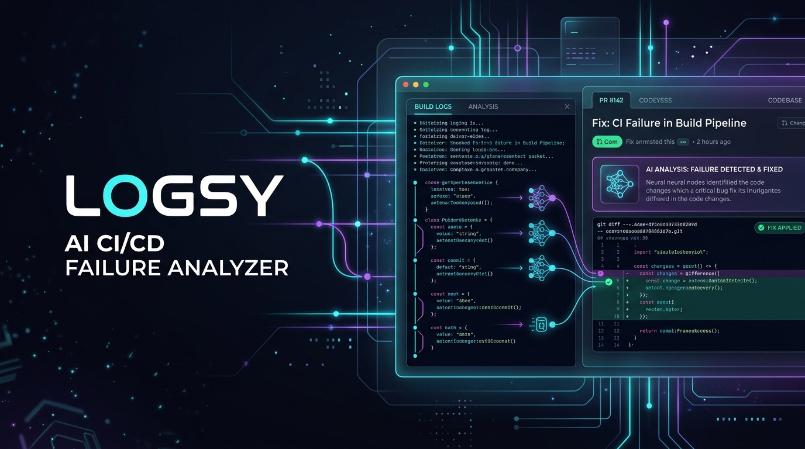
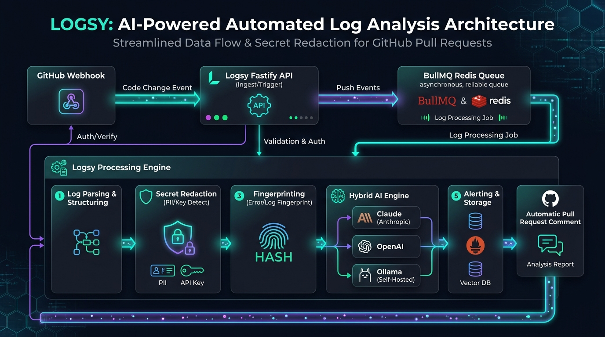
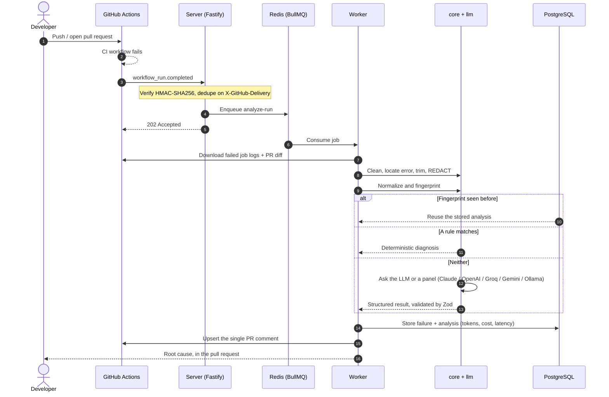

<p align="center">
  
</p>

<p align="center">
  <strong>Intelligent, noise-free CI failure analysis for GitHub Actions.</strong><br>
  <em>Finds the real error in thousands of log lines, redacts secrets, and posts one concise, actionable PR comment.</em>
</p>

<p align="center">
  <a href="https://github.com/nodejs/node"></a>
  <a href="https://www.typescriptlang.org/"></a>
  <a href="https://fastify.dev/"></a>
  <a href="https://orm.drizzle.team/"></a>
  <a href="https://redis.io/"></a>
  <a href="https://turbo.build/"></a>
  <a href="./LICENSE"></a>
</p>

---

## The problem

CI fails. You open the run, scroll through 4,000 lines of `npm install` output, find three
different red blocks, and spend ten minutes working out which one actually broke the build —
only to discover it was the same flaky test as last Tuesday.

Logsy installs as a GitHub App. On the next failure it reads the logs, finds the root error,
and leaves one comment on the pull request:

<!-- Demo recording goes here: docs/assets/demo.gif -->
<p align="center"><em>📽️ Demo recording — coming soon.</em></p>

Real output, from `pnpm demo` over a fixture in this repository:

```markdown
### npm could not resolve the dependency tree

📦 Dependency error · **build** › `npm ci` · [view run](https://github.com/…/actions/runs/…)

npm found conflicting peer dependency requirements and refused to install a tree that
satisfies none of them.

<details>
<summary>Evidence from the log</summary>

npm ERR! ERESOLVE unable to resolve dependency tree
npm ERR! Found: react@18.3.1
npm ERR! peer react@"^19.0.0" from react-dom@19.0.0

</details>

**Suggested fix**

Read the conflict npm prints and align the versions in package.json. …

> Seen 4 times in this repository

---

matched a known failure pattern · confidence 90% · Was this helpful? [👍](…) [👎](…) · Logsy for `9f2c1ab`
```

That is the whole product. One comment, updated in place on every re-run, replaced by a
✅ when the build goes green.

---

## What it does

- 🎯 **Finds the real error.** Strips ANSI codes and timestamps, splits the log into steps,
  locates the failing one, and prefers the first root error over the cascade of follow-up
  errors it caused.
- 🛡️ **Redacts before anything else.** GitHub tokens, AWS keys, JWTs, private key blocks,
  connection strings, bearer tokens and high-entropy strings are replaced with
  `[REDACTED:type]` **before** any log is stored, logged or sent to a model.
- ⚡ **Rules first, LLM second.** 26 deterministic rules cover the common failures across
  Node, Java/Maven, Gradle, Python, Go and Docker — instant, free, and never wrong about a
  pattern they match. The model is only asked about what the rules cannot answer.
- 🔁 **Remembers.** Errors are normalized and fingerprinted, so a failure that has been
  explained once is never paid for twice, and recurring breakages are counted.
- 💬 **One comment. Ever.** Found by a hidden marker and updated in place, never re-posted.
  Below 0.5 confidence it shows the error excerpt and says nothing more — a wrong answer
  costs more trust than no answer.
- 🎲 **Knows your flaky tests.** Parses JUnit artifacts and flags any test that both passed
  and failed on the same commit.
- 📊 **Dashboard.** Failure trends, recurring fingerprints, category breakdown, flaky tests,
  per-repo settings, and how often the analyses were judged helpful.
- 🔒 **Yours.** Self-hosted in one `docker compose up`, bring your own key, or run entirely
  offline against a local Ollama model.
- 🤝 **Models that check each other.** Optionally, a panel of models (for example Groq and
  Gemini, both on free tiers) analyzes each failure in parallel; when they disagree, Logsy
  stays quiet instead of guessing.

---

## Architecture

<p align="center">
  
</p>



The receiver does no heavy work: it verifies, dedupes, enqueues and returns `202` in
milliseconds. Everything expensive happens in the worker, where it can be retried.

### Repository layout

```text
logsy/
├── apps/
│   ├── server/          # Fastify: webhook receiver, health, signature verification
│   ├── worker/          # BullMQ jobs: analyze-run, post-comment, test-report
│   └── web/             # Next.js dashboard (App Router, Tailwind, Auth.js)
├── packages/
│   ├── core/            # Pure, zero-I/O: cleaning, error location, redaction,
│   │                    #   fingerprinting, rules, JUnit parsing, comment markdown
│   ├── github/          # Octokit app, typed helpers for jobs, logs, artifacts, PRs
│   ├── llm/             # Providers (Anthropic, OpenAI, Groq, Gemini, Ollama) + panel voting
│   ├── db/              # Drizzle schema, migrations, query helpers
│   ├── queue/           # Queue names, Zod job payloads, Redis connection
│   └── config/          # Zod-validated env, shared tsconfig and ESLint config
├── evals/               # Labeled real CI logs + accuracy harness
├── deploy/
│   ├── docker-compose.yml
│   └── helm/            # Kubernetes chart
└── docs/
    ├── github-app-setup.md
    └── self-hosting.md
```

`packages/core` performs no I/O at all — no network, no database, no filesystem. That is
what makes the interesting half of this project testable with plain strings.

---

## Quick start

### Prerequisites

- Node.js 22.12+ · pnpm 10 · Docker

### Local development

```bash
git clone https://github.com/hsanjebri/Logsy.git
cd Logsy
pnpm install
cp .env.example .env

pnpm db:up          # Postgres 16 + Redis 7
pnpm db:migrate

pnpm lint && pnpm typecheck && pnpm test
```

Then, in three terminals:

```bash
pnpm dev:server     # webhook receiver  :3000
pnpm dev:worker     # analysis worker
pnpm dev:web        # dashboard         :3002
```

To connect a real repository, follow the [GitHub App setup guide](./docs/github-app-setup.md) —
it covers permissions, events, the private key and forwarding webhooks with smee.

### Self-hosting

```bash
cp .env.example .env    # fill in the GitHub App values
docker compose --env-file .env -f deploy/docker-compose.yml --profile apps up -d
```

Postgres, Redis, migrations, server, worker and dashboard. See
[docs/self-hosting.md](./docs/self-hosting.md) for the Helm chart, upgrades, backups and
running without any LLM.

---

## Accuracy

`pnpm evals` runs the real pipeline over the labeled CI logs in `evals/fixtures/` —
collected from public failures in Maven, Gradle, pytest, pandas, vitest, ESLint,
TypeScript, Docker Compose and pre-commit — and writes a dated report to `evals/results/`.

Baseline (rules only, no LLM calls), 2026-09-19:

| Metric                  | Value                          |
| ----------------------- | ------------------------------ |
| Fixtures                | 10                             |
| Resolved without an LLM | 8                              |
| Category accuracy       | 80% overall · 100% of answered |
| Keyword hit rate        | 76%                            |
| Average confidence      | 0.90                           |
| Cost                    | $0.00                          |

The two unanswered fixtures have no recognizable pattern (a custom script error and a bare
`exit 1`) — exactly the cases the LLM layer exists for. A wrong answer costs more trust than
no answer, so the rules stay silent rather than guess.

```bash
pnpm evals          # rules only, free
pnpm evals --llm    # also sends unmatched fixtures to the configured model
```

---

## Privacy

Build logs are some of the most credential-dense text a company produces. Logsy is built on
the assumption that yours should stay yours.

- **Redaction happens first.** `redactSecrets` runs before a log is stored, written to a
  structured log line, or put in a prompt — not as a later filter. It covers GitHub tokens
  (`ghp_`, `gho_`, `ghs_`, `github_pat_`), AWS keys, private key blocks, JWTs, bearer
  tokens, assigned `password=` / `secret=` / `token=` values, credentials in connection
  strings, email addresses and high-entropy strings. It has its own test suite.
- **Minimum permissions.** Actions: read · Checks: read · Contents: read · Pull requests:
  write · Metadata: read. Logsy can never push code.
- **Bring your own key**, or no key at all: `LLM_ENABLED=false` runs on rules and cache
  alone. `LLM_PROVIDER=ollama` keeps every byte on your own hardware.
- **Diffs are summarized, not shipped.** The PR context sent to a model is capped in both
  file count and patch size.
- **Nothing leaves your database.** There is no telemetry, no phone-home, no hosted
  service. Sentry and OpenTelemetry are optional and off unless you set their variables.
- **Webhooks are verified** with a constant-time HMAC-SHA256 comparison against the raw
  body, deduplicated by delivery id, and rate-limited per installation.

---

## Roadmap

- [x] **Phase 0** — Monorepo, strict TypeScript, Docker, CI
- [x] **Phase 1** — GitHub App, webhook receiver, signature verification, schema
- [x] **Phase 2** — Queue, worker, log fetching, rate-limit awareness
- [x] **Phase 3** — Log processing core: cleaning, error location, trimming, redaction
- [x] **Phase 4** — Fingerprinting, analysis cache, 26-rule engine
- [x] **Phase 5** — LLM adapters, structured output, eval harness
- [x] **Phase 6** — The single PR comment
- [x] **Phase 7** — Dashboard
- [x] **Phase 8** — Flaky test detection from JUnit artifacts
- [x] **Phase 9** — Feedback, Docker images, Helm chart, observability, security pass
- [ ] Auto-fix pull requests for the failures a rule can repair
- [ ] GitLab CI and CircleCI
- [ ] Slack notifications for recurring breakages

---

## Contributing

New rules and real log fixtures are the most valuable contributions — see
[CONTRIBUTING.md](./CONTRIBUTING.md). Reporting an analysis that was _wrong_ is just as
useful as reporting one that crashed.

## License

[MIT](./LICENSE).
